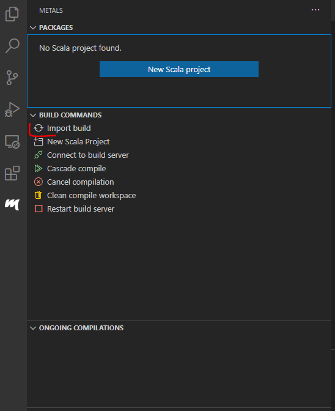
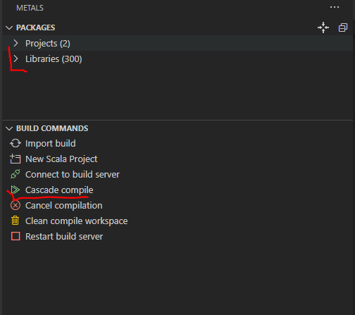
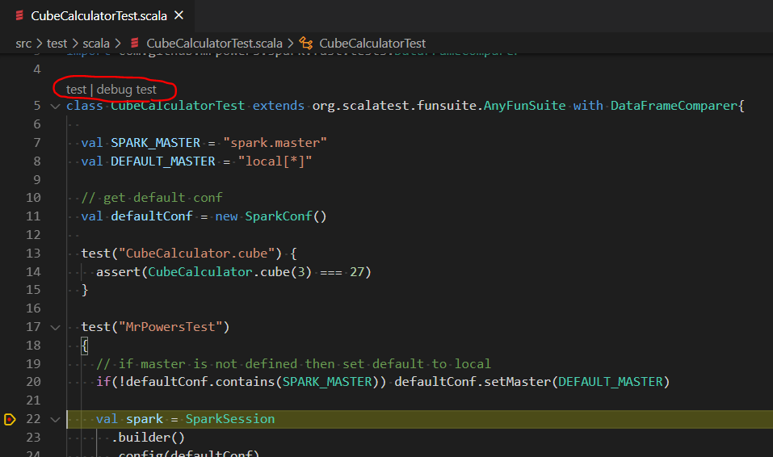
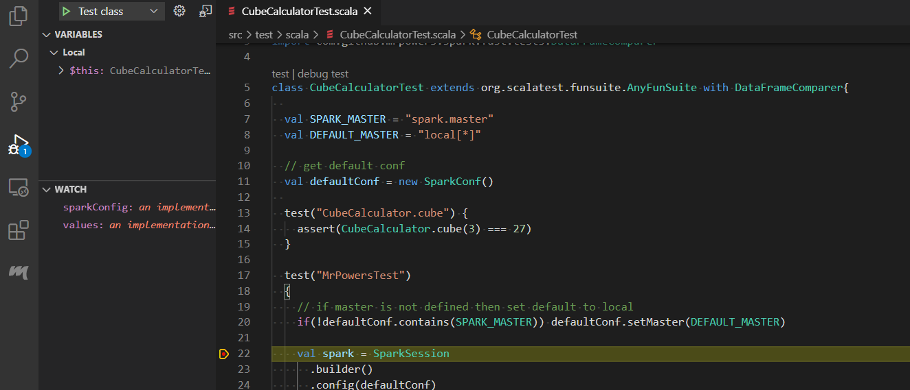

# Local Development of Scala Spark Jobs using Visual Studio Code Remote - Containers

In this repository we show how to run and test Scala Spark Jobs locally using [Visual Studio Code Remote -Containers extension](https://code.visualstudio.com/docs/remote/containers). 

As during any other development also when developing Spark Jobs you want to have possibility to test your code locally and have quick feedback loop available, to see how your newly introduced changes behave. 

One option is to install and configure Java, Spark and sbt on your local machine, what can be quite cumbersome. If you are one of the developers, who like to experiment with various technologies and you probably remember times, when your dev machine became totally messy due to all the dev tooling installations you performed. Luckily Docker containers came for the rescue and enabled us to create development environments running inside the Docker Containers, with all the tooling available and without polluting or dev machine. 

Visual Studio Code and its Remote - Container extension made it very easy to build the dev environment in Docker container and to do the entire development in that environment.

Below we provide step by step guide on how to setup the local dev environment for Scala Spark Jobs

Note: this approach can be utilized also in case you are using Databricks to host your jobs and you still want to have possibility of local development without using Databricks Connect and having to run Databricks cluster. 

### Configuring Dev Container

1. **Follow installation guide state in documentation [Visual Studio Code Remote - Container extension]()**

2. **Create Dockerfile to define Dev Container**

   As a first step you should create .devcontainer folder in the root folder of your Scala solution and create Dockerfile. As we need Spark to be present in our local dev container we are using bitnami/spark:3.0.0 base image. We also need to create new User Group and add new spark user to that group. As a last thing we expose Spark Master console running on port 8080. Notice also commented out piece of Dockerfile which demonstrates how to install additional packages if needed.

   Dockerfile:

   ```dockerfile
   FROM bitnami/spark:3.0.0
   
   # Installing package into Spark if needed
   # spark-shell --master local --packages "<package name>"
   
   ARG USERNAME=spark
   ARG USER_UID=1000
   ARG USER_GID=$USER_UID
   
   # Create the user
   RUN groupadd --gid $USER_GID $USERNAME \
       && useradd --uid $USER_UID --gid $USER_GID -m $USERNAME 
   
   EXPOSE 8080 4040
   ```

3. **Create [devcontainer.json](https://code.visualstudio.com/docs/remote/devcontainerjson-reference) configuration file**

    From documentation: *A `devcontainer.json` file in your project tells Visual Studio Code how to access (or create) a **development container** with a well-defined tool and runtime stack.* In other words you can forward environment variables and arguments to your container, define settings and extensions you want your VS Code instance running in container to have and other. In our case we are configuring following settings: 

   - Forwarding SPARK_MODE argument to Spark engine running in the container
   - service to connect to/run 
   - VS Code settings (start integrated linux bash shell when connected to container) e
   - VS Code extensions to be installed 
     - [scalameta.metals](https://scalameta.org/metals/docs/editors/vscode.html) - to enable build and running of scala code
     - scala-lang.scala - to have proper IDE code linting)
   - Set port forwarding for container to forward port 8080 where Spark master console is running and
   - Set *overrideCommand* to false, otherwise VS Code Remote - Container extension would override default command of bitnami base image and Spark would not start. 

   There is quite a lot of other options you can set in devcontainer.json. For more details please refer to the documentation.

4. Open Visual Studio Code command windows by pressing CTRL+SHIFT+P and run R*emote-Containers: Open Folder in Container* command. This will initiate build and run of development Docker container

### Running Scala Spark job in Dev Container

Now everything is setup for you to run your Scala Spark Job inside dev container. As mentioned we have installed Scalameta.Metals extension which enables us to build and run scala code. Let's see how to use it.

In this repository you can find two Scala files. In the main folder there is [CubeCalculator.scala](src/main/scala/CubeCalculator.scala) file containing  logic to calculate volume of a cube and in the test folder there is [CubeCalculatorTest.scala](src/main/scala/CubeCalculator.scala) file with two simple tests we will run. One of them tests CubeCalculator logic and second one demonstrates how to connect to Spark Engine running in the container. It also makes use of [MrPowers.spark-fast-tests](https://github.com/MrPowers/spark-fast-tests) Apache Spark test library for Scala, which for instance allows to compare DataFrames. Solution folder also contains [build.sbt](build.sbt) file, which holds Scala build configuration which get's picked up by Metals extension.

So that we can run the scala code first we need to run Import build using Metals extension:



Note that metals extension is using  embedded sbt launcher but it has some limitations documented [here](https://scalameta.org/metals/docs/editors/vscode.html#custom-sbt-launcher). In case you want to use your own sbt script, you can install it in the separate RUN step in dev container Dockerfile by adding following lines just after the `USER root` line: 

```dockerfile
RUN \
  apt-get update && apt-get install -y gnupg2 && \
  echo "deb https://dl.bintray.com/sbt/debian /" | tee -a /etc/apt/sources.list.d/sbt.list && \
  curl -sL "https://keyserver.ubuntu.com/pks/lookup?op=get&search=0x2EE0EA64E40A89B84B2DF73499E82A75642AC823" | apt-key add  && \
  apt-get update && \
  apt-get install -y sbt && \
  sbt sbtVersion
```

Then you just need to configure the metals extension to use the desired sbt script as documented in the provided link. This should be possible in devcontainer.json file, but we haven't explored a way how to do it, as we didn't need to use custom sbt script. 

After build is done, you should see that metals recognized your solution packages. Next you need to compile your files by running Cascade compile:



Once solution is compiled you can navigate to your Scala files and you will see *run | debug* respectively *test | debug test* options on top of your object/class definitions. Now if you create breakpoint in your code and you will run debug, those breakpoints will be hit.



If you want to use Visual Studio Code native run/debug approach you should include your configuration in *launch.json*. Below we are providing example of configuration we use to run the tests:

```json
{
    "version": "0.2.0",
    "configurations": [
      // Test class configuration
      {
        "type": "scala",
        "request": "launch",
        // configuration name visible for the user
        "name": "Test class",
        // full name of the class to run
        "testClass": "CubeCalculatorTest",
        // optional build target name in case there is more than one
        // class with the same name
        "buildTarget": "root-test"
      }
    ]
}
```

Then if you navigate to Run tab, you can select the run configuration (Test class in our case) and run it, while breakpoints will be hit as well.



### Summary

This repository demonstrates how to start with local development of Scala Spark Jobs without need of installation of Spark Tooling on local dev machine. It by know means describe advanced dev scenarios, but it aims to provide jump start guidance on hot to start debugging your Scala Spark Jobs and summarizes my exploration when dipping my toes into the waters of development of Scala Spark Jobs. 